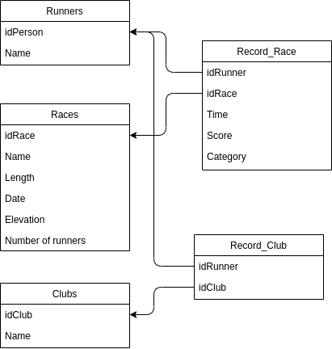
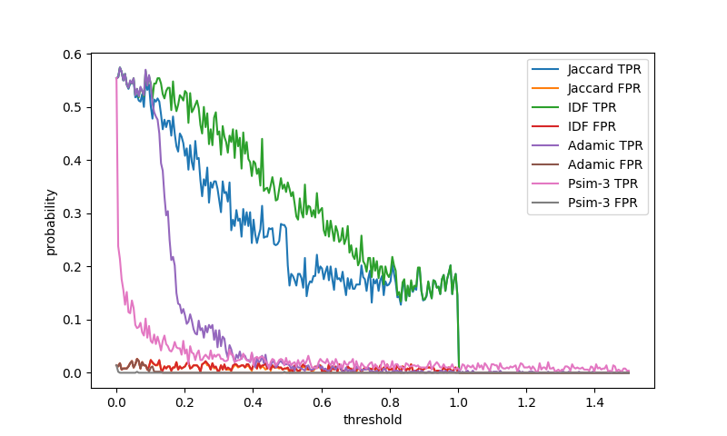
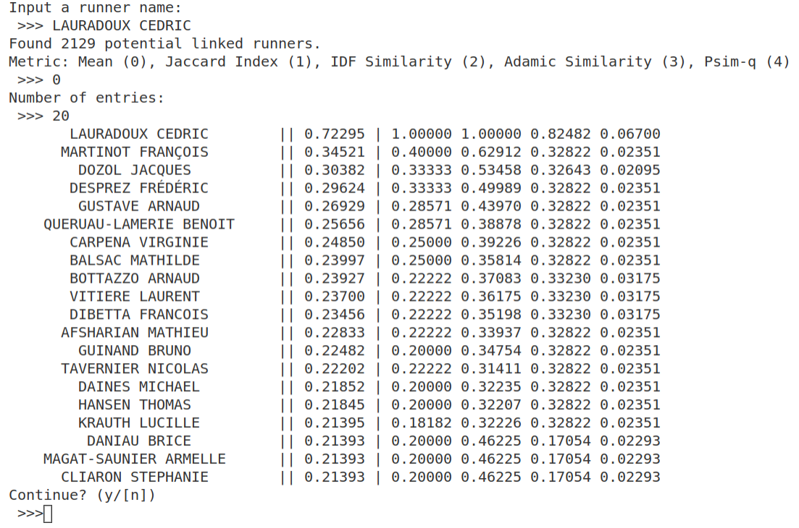

# Introduction

# Scraping

The scraping is a technique that aims to find and collect data directly from the HTML code of a website, in this specific case we used a specific module called "Selenium" that run on a python engine.
This module allows to easily obtain a "webdriver" which is a construct that can freely surf the net exactly like a human user. The driver we used is a `chromedriver` which allows the scraper to navigate through Google Chrome.

The basic idea of a scraping process is to find a fixed path through which the driver can be able to constantly obtain new information, process and finally store them.
Selenium provides lots of different ways to find and extrapolate data, the most used in our scraper is the XPATH, that is a unique identifier for every HTML construct.
Thanks to the analysis of the website it was found a page with all the races chronologically ordered; for each race in the list the driver collected: number of participants, date, name of the race, elevation (if present), length and the name of every runner with some related information.

In order to handle easily all the data we used python classes filled with the collected data. This solution has been revealed really handy.
Once collected, the data is saved in a open source relational database in 5 different tables: `Person`, `Race`, `Record_Race_Person`, `Record_Club_Person` and `Club`. PostgreSQL was used for its simplicity of installation and for its good matching with python. The architecture of the database can be found in figure \ref{2} in appendix.

In a short time this method proved to be particularly effective allowing to populate the database in a consistent way.
Almost six hundred thousands of different people are present in the database, who, in total, have recorded more than one million races.
The races scraped from the sites are all about the last 3 years (from early 2018 to 2021). Another intresting data collected is the Club in which a runner can enroll and race for, in more than two thousands races over one hundred thousand different clubs participated.

The amount of data is schematically transcribed here:

- 590912 records fetched from table `Person`

- 2217 records fetched from table `Race`

- 102190 records fetched from table `Club`

- 347362 records fetched from table `Record_Club_Person`

- 1028563 records fetched from table `Record_Race_Person`

# Data Analysis

All the collected data is processed to guess linked people in the set of collected runners. To do so, we need a function to quantify how probable is the fact that two people know each other based on their race records. This type of function is called similarity metrics. Metrics needs to be analysed to select the correct threshold and to compare how well they perform on this specific application. Finally, the refined metrics are used to build the Python application.

## Selected Similarity Metrics

The metrics chosen for this application are taken from the paper written by @cunche:hal-00747825.
To infer social link between runners, we need to see the races they have in common in their record and how likely they have been in contact in this race. To measure this second parameter, we use the number of participants in each common race. The less people there are in the race, the most probable it is that the two persons were in contact and may know each other.

- *Jaccard index*: This metric focuses on the proportion of common races in the record. it is defined as $\text{J}(X,Y) = \frac{|X \cap Y|}{|X \cup Y|}$.

- *IDF similarity*: This metric depends on a measure of the rarity of a race defined as $IDF_i = \log \frac{1}{f_i}$ with the frequency of the race $f_i$ equals the number of participants. Finally the metric is define as followed.
$$
\text{Cosine-IDF}(X,Y) = \frac{\sum_{x \in X \cap Y} IDF_x^2}{\sqrt{\sum_{x \in X} IDF_x^2} \sqrt{\sum_{y \in Y} IDF_y^2}}
$$

- *Adamic similarity*: This metric also depends on the frequency $f_i$ defined as the number of participants in the race $i$. This metric is defined as $\text{Adamic}(X,Y) = \sum_{i \in X \cap Y} \frac{1}{\log f_i}$.

- *Modified Adamic similarity*: In order to put more weight on the rarity of the races, the Adamic similarity is changed to $\text{Psim-q}(X,Y) = \sum_{i \in X \cap Y} \frac{1}{f_i^q}$.

## Metrics Evaluation

The following part aims at assessing how accurately the previous metrics are at infering social links. As all the metrics return a number, we need to define a threshold such that if the returned value is above the threshold, we consider that the two persons are linked and if the returned value is below the threshold, we consider that the two person are not linked.

The first method followed by the paper written by @cunche:hal-00747825 is to separate the database into two sets: a first set where every person is really socially linked to another one and another set where there is no couple of linked people. Then, we run the metric on the whole set and count the number of true positives, true negatives, false positives and false negatives. The closer we get from reality, the most accurate is the metric.
As we didn't had the time and ressources to build such databases based on verified testimonies, we made the following simplifying assumption: *two people know each other if and only if they ran in the same club at least one time*. This assumption was the only possible one with our collected data because the clubs are the closest information from the social link that was not used by our metrics.

Running the metrics analysis based on this assumption gave the results diplayed in figure \ref{1} in appendix. The true positive rate is defined as $\text{TPR} = \frac{n_{TP}}{n_{TP} + n_{FN}}$ and the false positive rate as $\text{FPR} = \frac{n_{FP}}{n_{FP} + n_{TN}}$ with $n_{TP}$ the number of true positives, $n_{TN}$ the number of true negatives, $n_{FP}$ the number of false positives and $n_{FN}$ the number of false negatives. We observe that no metric gives a true positive rate higher than $0.6$ which is highly insufficient to be reliable. From this result we can conclude that either our metrics are not pertinent to infer social links or our previous assumption is too often false, i.e. people from different clubs know each other.

As we could not properly conduct this analysis, the choice of the threshold and metric in the final application is left to the user.

## Analysis Python Module

The final application asks for a name and computes the metrics for all potentially linked runners from the database. We start by fetching all runners that have at least one race in common with the targetted runner. Then we compute the metrics matrix that stores the value returned for each metric and for each runner. Finally we provide a way for the user to have a comprehensive view of this matrix by displaying the most probable linked runners based on each metric or the mean of all them.

This application was designed for runners to check if they suffer from a privacy breach on this particular website and to see if they are vulnerable to social engineering attacks.
For instance, we ran the application of a known runner and the application provided a very good result in second position based on the mean of all metrics. The output of the application is diplayed in figure \ref{3} in appendix. This proves that this application can be a tool to perform social engineering attacks.

# Conclusion

# Appendix

## Implementation and usage

The code of both parts of this project is publicly available at <https://github.com/Paolodaolio/Scrapy_Crawler>.
The scraping part is stored under `scraping_module/` and the analysis part under `analysis_module/`. The `docs/` directory stores all the documents used to make this report and the associated presentation.

For the scraping module, ...

For the analysis module, all the files that make the connection with the database are under `database/`, the python classes are under `classes/` and the main programs are directly in `analysis_module`. Like for the scraping module, the file `database/connection.py` is used to connect to the PostgreSQL database and the file `database/manager.py` is used to perfom queries on the database.

In this module, to create a runner we only provide it's name and the program automatically fetches it's ID in the database and all the races he ran. This is implemented in `classes/runner.py` and uses the `fetch_runner_by_name` function that return the runner's ID and the `fetch_races_by_runner` function that return every race of this runner ID from `database/manager.py`.

The metrics are implemented based on their formal definition in `analysis_module/metrics.py`.

The metrics evaluation part is implemented in `analysis_module/metrics_analysis.py`. This module plots a curve of true positive rate and false positive rate for each metric and for a range of thresholds. It is based on the assumption stated above. So the `random_linked_runners` function provides a pair of runners that ran at least one time in the same club. Then for half the samples, we take random runners that are not linked, and for the other half, we take random linked runners and we compute in parallel the rates for each metric in the function `metric_evaluation`.

The final application is provided in `analysis_module/main_link.py`.

To make it work, the user needs to be connected to the database filled with the data scraped by the scraping module. This data is stored in `Data/backup_[date]` and can be loaded in a postgreSQL database with the command `psql runners < backup_[date]`. It may be required to tweak the file `analysis_module/database/connection.py` to match each specific configuration of the database. All the queries needed to perform the analysis are implemented in `analysis_module/database/manager.py`.

## Figures

{ width=65% }

{ width=100% }

{ width=100% }

\newpage

# References
